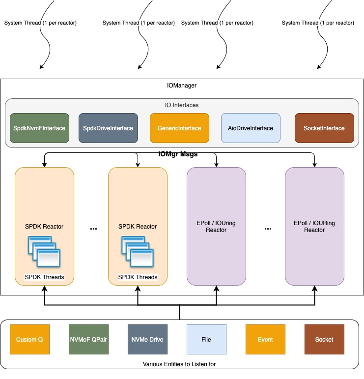

# IOManager

IOManager tries to bridge the gap in existing async framework to build full async networked database/storage/keyvalue storage. Motivation and design are explained below.

## Motivation
Typical storage or database applications if it intends to do things in async manner, need some sort of multiplexing of multiple interfaces. The popular event libraries such as libevent, grpc iomanager all does multiplexing of multiple socket/network interfaces. Once a thread pulls the data or command from network, it typically transfers the ownership to another threadpool if it has to do some IO activity. The IO activity will typically be using conventional system call APIs done synchronously.

However, it is proven that passing to different threadpool takes up quiet a bit of CPU because of context switching and unbalanced memory access. The model that gets fastest performance with least amount of CPU is run to completion. There will be N threads for N cores in the system, then each thread listens for work and accomplishes the work in the same thread. This model works well with other libraries provided they do not perform any IO activity. Given that there is no way to multiplex with IO interfaces, it is impossible to build this with existing well known libraries.

Even if there are some libraries (possibly libuv) which could provide multiplexing of both, there are other factors to consider, which is type of notification (interrupt or tight loop polling).

### SPDK
Intel has come up with SPDK (Storage Performance Development Kit) 

## Design


## Build
To build (assuming a recent version of conan package manager is installed)
```
   $ conan create . <user>/<channel>
```
To publish:
```
   # You'll need credentials for this!
   $ conan upload -r origin iomgr/<version>@/<user>/<channel>
```
Official builds can be found under the **user** ``sds`` in either the ``stable`` or ``testing`` channels.
```
   $ conan search -r origin iomgr*
```
